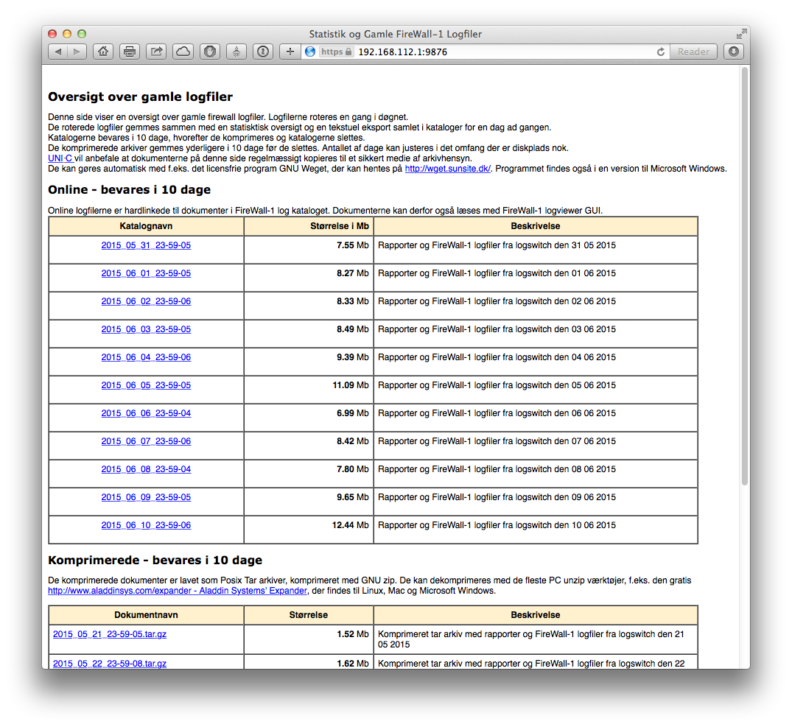
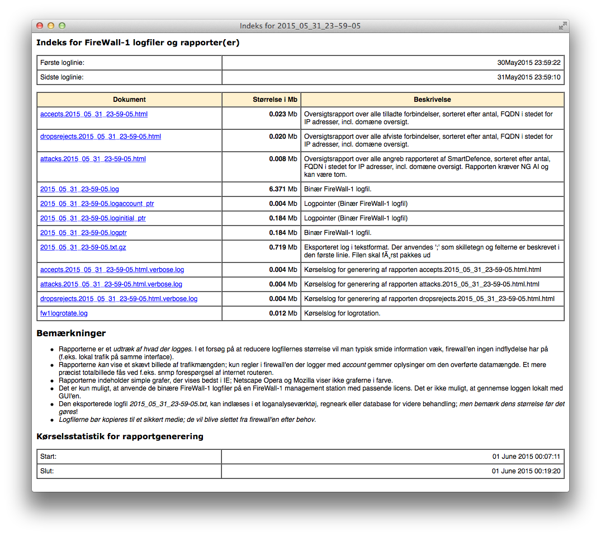

# Introduction

**UNIfw1lr** - _UNI•C FireWall-1 Log Rotation_ - is a simple firewall log
rotation and log management solution for Check Point firewall-1 made by UNI•C,
now i2.dk.

This version is compatible with
[GAiA](http://en.wikipedia.org/wiki/Check_Point_VPN-1 ) and has been tested on
Check Point R77.10, R77.20 and R77.30, and should work with all later R77.x
versions, both appliances and open servers. It is not compatible with Secure
Platform.

Once installed all firewall logs gets

1. rotated on a daily basis
2. exported to a CSV text file with each field described in the first line
2. processed by report generator that generates top 10 reports on
    - accepted traffic
    - dropped and rejected traffic 
    - attacks

The log files will be visible through the _Check Point Log Viewer_  for a
specific number of days (default 10), then compressed and left in the
filesystem for default 20 days more, before they are deleted.

All files are available for download from a SSL enabled WebServer (installed
with the firewall) running on TCP port 9876. The WebServer uses the certificate
from defaultCert.

**UNIfw1lr** is free software and released under a
[modified BSD License](https://opensource.org/licenses/BSD-3-Clause), see LICENSE. Using the
software requires a valid support contract with [Check Point Technologies](http://www.checkpoint.com).

# Prerequisites and caveats
Please _disable all Check Point log rotation configurations_, as it will
interfere with **UNIfw1lr** and prevent purging of logs rotated by Check Point
due to differences in log file naming.

# Installation
**UNIfw1lr** is installed as a package (RPM) and requires the package
**UNItools** to be installed first. UNIfw1lr is installed on the management
station. It may also be installed on enforcement modules, to avoid filling the
filesystem with log files in case of error(s).

# How does UNIfw1lr work
**UNIfw1lr** runs every day at **23:59**. It does log file house keeping
according to its configuration file stored in ``/var/opt/UNIfw1lr/etc/fw1logrotate.conf``.

*  The _active firewall log_ is switched and the old log file exported to a
*  [cvs file](http://en.wikipedia.org/wiki/Comma-separated_values). The first line describes the fields.
   The exported file may be quite large and on a busy system exceed 2,147.483.647 Gb which may cause problems
   on 32bit systems (see [2GB file-size limit](http://linuxmafia.com/faq/VALinux-kb/2gb-filesize-limit.html)).
* Tree reports are made based on the exported log:
    * **top 10 accepted** for _rules_, _source_, _destination_ and _protocol_.
    * **top 10 dropped and rejected** for _rules_, _source_, _destination_ and _protocol_.
    * **top 10 attack** for _rules_, _source_, _destination_ and _protocol_.
* Logfiles older than a specific date (default 10) is compressed.
* Compressed log files older than a specific date (default 20) is deleted.

The reports are made with [fwlogsum 5.0.2](http://www.ginini.com/software/fwlogsum)
(C) 1996-2004 Peter Sundstrom, peter@ginini.com. This may be changed in
[default.report.sh](src/GaIA/default.report.sh).

**UNIfw1lr** starts an SSL enabled WebServer on boot. The server is part of the
base operating system and maintained by Check Point. The server binds to a
specific IP address and TCP port 9876. The server does not require login and
password and should be restricted to e.g. the admin group and e.g. a log
consolidator system.

An example is shown here:

In the example the server is bound on ``192.168.112.1`` so the server URL is 

      https://192.168.112.1:9876

Notice that the [SSL certificate](http://en.wikipedia.org/wiki/Self-signed_certificate)
will cause a browser warning.

The servers configuration file is ``/var/opt/UNIfw1lr/etc/httpd2.conf``. The default
bind address is 127.0.0.1.

# What not to expect from UNIfw1lr
**UNIfw1lr** is not a replacement for
[Check Point SmartLog](https://www.checkpoint.com/products/logging-status-featuring-smartlog/index.html)
but primarily a tool to rotate and compress log files, and make them available
for a log archiver.

# Using UNIfw1lr
**UNIfw1lr** should be accessed by a [_log consolidator_](http://en.wikipedia.org/wiki/Log_management)
for collecting and archiving log files. A simple shell script (`get_firewall_logs.sh`) which will
collect the  log files from an external server is located in `/var/opt/UNIfw1lr/docs`.

If you choose to use [GNU wget](http://www.gnu.org/software/wget/) /
[wget for windows](https://eternallybored.org/misc/wget/) you may use the
[bash for windows](https://www.cygwin.com) snipet:

<pre>
 wget -N --reject 'index.html' -r -m --no-check-certificate \\
    	https://${SRVR}:${PORT} > ${TMPFILE} 2>&1
    ERRORS=$?
    case $ERRORS in
        0)  MSG="wget: No problems occurred."
        ;;
        1)  MSG="wget: Generic error code."
        ;;
        2)  MSG="wget: Parse error"
        ;;
        3)  MSG="wget: File I/O error."
        ;;
        4)  MSG="wget: Network failure."
        ;;
        5)  MSG="wget: SSL verification failure."
        ;;
        6)  MSG="wget: Username/password authentication failure."
        ;;
        7)  MSG="wget: Protocol errors."
        ;;
        8)  MSG="wget: Server issued an error response"
        ;;
    esac
</pre>

# Known limitations
  * **UNIfw1lr** uses [hard links](http://en.wikipedia.org/wiki/Hard_link) to
    minimize disk usage. This requires all files to reside on the same
    partition: ``$FWDIR/log`` and the directory used by **UNIfw1lr** to store
    files must be on the same partition. This is ensured during package
    installation.
  * R77.xx comes in two flavors: 32bit and 64bit. Smaller appliances like the
    [2200 series](https://www.checkpoint.com/downloads/product-related/datasheets/2200-appliance-datasheet.pdf)
    has a 32bit CPU and therefore suffers from the 2.1Gb file size limitation.

